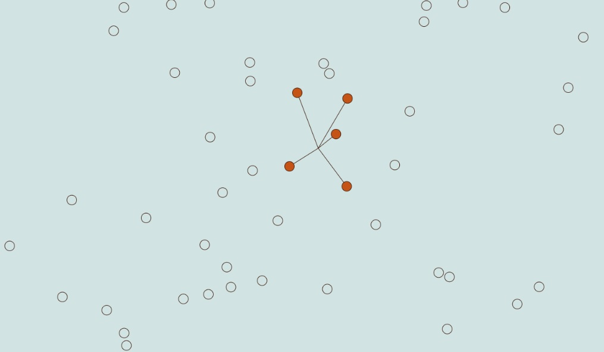

# Map path experimentation

## Description

Side HTML/CSS/JS project using canvas to draw circles. The 5 nearest points from cursor are connected with lines.



## Usage

To start the project, run the following script from the root of your project's directory

```
npm install
npm start
```

## Credits and references

- **Project** generated by [HTML5Boilerplate](https://html5boilerplate.com/)
